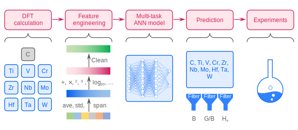

  [](https://zenodo.org/badge/latestdoi/664905835)

# Elastic net  
### **Machine learning model for predicting multi-component transition metal carbides (MTMCs)**
### This is the manual to reproduce  results and support conclusions of ***Lattice Distortion Informed Exceptional Multi-Component Transition Metal Carbides Discovered by Machine Learning***.

We recommend using a Linux/Windows operating system to run the following examples, under the [current directory](.).  




# Table of Contents
- [Installation](#Installation)  
- [Example of using the well-trained model](#example-of-using-the-well-trained-model)   
- [Train a new model from scratch](#train-a-new-model-from-scratch)   
  - [Prepare DFT calculations](#prepare-DFT-calculations)  
  - [Collect DFT results](#collect-DFT-results)  
  - [Run main function](#run-main-function) 
  - [Collect input features and labels](#collect-input-features-and-labels)  
  - [Train](#train)  
  - [Check training results](#check-training-results)   
  - [Predict](#predict)  
  - [High-throughput predict](#high-throughput-predict)  
  - [Ternary plot](#ternary-plot)  

- [Other scripts](#other-scripts)
  - [Get ROM](#get-ROM)
  - [get VEC](#get-VEC)

- [Abbreviations](#abbreviations)

# Installation

### Install under [conda](https://conda.io/projects/conda/en/latest/user-guide/install/index.html) environment

- Create a new environment   
```console
conda create -n ElasticNet python==3.10
```

- Activate the environment  
```console
conda activate ElasticNet
```

- Install package  
```console
pip install elasticnet
```

### Alternatively, you can install with [pip](https://pypi-url).
- Install the package. User `--user` if you don't have the root permission.  
```console
pip install elasticnet --user
```

- **If your IP locates in mainland China, you may need to install it from the tsinghua mirror.**  
```console
pip install elasticnet -i https://pypi.tuna.tsinghua.edu.cn/simple
```


**Requirements file:** [requirements.txt](requirements.txt)

**Key modules**  
```
numpy==1.25.0    
scikit-learn==1.2.2   
tensorflow==2.10.0   
ase==3.22.1  
pandas==1.5.3
```

# Example of using the well-trained model  

- Download the well-trained parameters: [checkpoint](checkpoint)  
- Run the following python code:  
```python
from elasticnet import predict_formula  
pf = predict_formula(config='input_config.json',ckpt_file='checkpoint')  
pf.predict(*['VNbTa', 'TiNbTa'])  
```
- The mechanical properties of (VNbTa)C3 and (TiNbTa)C3 will show on the screen. The specific modulus of each column is: B, G, E, Hv, C11, C44.
```python
array([[294.43195 , 203.70157 , 496.67032 ,  25.989697, 632.3356  ,
        175.50716 ],
       [283.17245 , 201.96506 , 489.7816  ,  26.824062, 607.07336 ,
        178.52579 ]], dtype=float32)
```

# Train a new model from scratch
### Prepare DFT calculations
- Bulk optimization.
- Elastic constants calculation.

### Collect DFT results
- Collect elastic constants into a file with `csv` extension. See example: [files/HECC_properties_over_sample.CSV](files/HECC_properties_over_sample.CSV).  
- You may refer to these papers to calculate modulus from C11, C12, and C44: [PHYSICAL REVIEW B 87, 094114 (2013)](https://doi.org/10.1103/PhysRevB.87.094114) and [Journal of the European Ceramic Society 41 (2021) 6267-6274](https://doi.org/10.1016/j.jeurceramsoc.2021.05.022)  
- The `*csv` file should contain at least these columns: `nominal_formula`, `C11`, `C12`, `C44`, `B`, `G`, `E`, `Hv`, and `real_formula`. See example: [files/HECC_properties_over_sample.CSV](files/HECC_properties_over_sample.CSV). 

### Prepare configurations files  
- [`input_config.json`](input_config.json): defines how to generate input features and labels. You are recommended to download this file and modify then.  
  |  Variable             | Type   | Meaning                                                                                                       |  
  |  -------------------- | ----   | ------------------------------------------------------------------------------------------------------------  |  
  | include_more          | bool | If `True`, the `bulk_energy_per_formula` and `volume_per_formula` are also be included in the input features. |
  | split_test            | bool | If `True`, a new test set will be split from the dataset. For cross validation, it is OK to set this as `False`. |  
  | clean_by_pearson_r    | bool | Clean input features. Highly correlated features will be removed if this is `True`. |  
  | reduce_dimension_by_pca | bool | Clean input features by [`PCA`](https://scikit-learn.org/stable/modules/generated/sklearn.decomposition.PCA.html#sklearn-decomposition-pca). Choose one among `clean_by_pearson_r` and `reduce_dimension_by_pca`.  |
  | prop_precursor_path   | str | A file storing the properties of precursory binary carbides. File extension can be `*.csv` and `*.json`.  See example: [file/HECC_precursors.csv](file/HECC_precursors.csv)|
  | model_save_path       | str | Path for storing [`PCA`](https://scikit-learn.org/stable/modules/generated/sklearn.decomposition.PCA.html#sklearn-decomposition-pca) model and other information when generating input features and labels |  
  | props                 | list | A list of properties that are encoded into the input features. Choose among the column names of [files/HECC_precursors.csv](files/HECC_precursors.csv).  |
  | operators    | list | A list of operators to expand the input dimension. Choose among: ['cube', 'exp_n', 'exp', 'plus', 'minus', 'multiply', 'sqrt', 'log10', 'log', 'square']. | 
  | HECC_properties_path   | str | A file contains the collected properties of MTMCs. |
  | labels   | list | A list of label names that need to fit/learn. |
  | soap_features   | bool | Whether to use [SOAP](https://singroup.github.io/dscribe/latest/tutorials/descriptors/soap.html) descriptor. |
  | soap_config   | dict | A python dict that defines the configuration of [SOAP](https://singroup.github.io/dscribe/latest/tutorials/descriptors/soap.html) descriptor.   - input_structure_type: 'POSCAR' or 'CONTCAR'. Use 'POSCAR' or 'CONTCAR' to generate [SOAP](https://singroup.github.io/dscribe/latest/tutorials/descriptors/soap.html) features.   - You can find the explanations for other specifications here: [`SOAP.__init__`](https://singroup.github.io/dscribe/latest/tutorials/descriptors/soap.html#dscribe.descriptors.soap.SOAP.__init__) |

- [`train.json`](train.json): defines how to train the machine-learning model.

  |  Variable             | Type   | Meaning                                                                                                       |  
  |  -------------------- | ----   | ------------------------------------------------------------------------------------------------------------  | 
  |  Nodes_per_layer | list   | Number of nodes of every hidden layers |  
  |  Number_of_fold | int   | Number of cross-validation folds. Normally `5` or `10`. |  
  |  feature_file | str   | A file contains input features. |  
  |  label_file | str   | A file contains labels of samples. |  
  |  Activation_function | str   | Activation function of hidden layers. Alternatives: 'relu', 'softmax', 'sigmoid', 'tanh' |  
  |  Output_activation | str   | Activation function of the output layer. Alternatives: 'relu', 'softmax', 'sigmoid', 'tanh' |  
  |  Number_of_out_node | int/'auto'   | Number of nodes of the output layer. If there is only *one* column in the `label_file`, this variable should be `1`. 'auto' is for multiple columns. |  
  |  Optimizer | str   | The name of the optimizer. Examples: [`tf.keras.optimizers`](https://www.tensorflow.org/api_docs/python/tf/keras/optimizers) |
  |  Cost_function | str   | Name of cost function in `Tensorflow`. Examples: [`tf.keras.losses`](https://www.tensorflow.org/api_docs/python/tf/keras/losses) |
  |  Metrics | list   | A list of metrics to evaluate the model. Examples: [`tf.keras.metrics`](https://www.tensorflow.org/api_docs/python/tf/keras/metrics) |
  |  Batch_size | int   | The batch size. See [`tf.keras.Model.fit`](https://www.tensorflow.org/api_docs/python/tf/keras/Model#fit)  |
  |  Epochs | int   | Number of epochs for training. See [`tf.keras.Model.fit`](https://www.tensorflow.org/api_docs/python/tf/keras/Model#fit) |
  |  Verbose | int   | Verbosity mode. See [`tf.keras.Model.fit`](https://www.tensorflow.org/api_docs/python/tf/keras/Model#fit)  |
  |  Regularization | bool   | Whether to used the L2 regularization. See [`tf.keras.regularizers.L2`](https://www.tensorflow.org/api_docs/python/tf/keras/regularizers/L2). |
  |  Model_save_path | str   | A folder to store the well-trained NN model. |
  |  Log_save_path | str   | A folder to store the training log. |
  |  Prediction_save_path | str   | A folder to store the predictions of input features after training. |
  |  SEED | int    | Random seed for shuffling input dataset. |

### Run main function

```console
python -m elasticnet
```

The following python code will be executed.
```python
def main():
    # prepare dataset
    from elasticnet.prepare_input import x_main, y_main
    x_main('input_config.json', load_PCA=False, save_PCA=True)
    y_main('input_config.json')

    # train
    from elasticnet.ann import CV_ML_RUN, load_and_pred
    CV_ML_RUN('train.json')
    load_and_pred('train.json', 'x_data_after_pca.txt', write_pred_log=True, drop_cols=None)

main()
```

You may want to prepare the dataset and train the model in separate steps, see below ↓.

### Collect input features and labels  
```python    
from elasticnet.prepare_input import x_main, y_main
x_main('input_config.json', load_PCA=False, save_PCA=True)
y_main('input_config.json')
```

Three files will be generated:  
- `x_data_init.txt`: input features without [`PCA`](https://scikit-learn.org/stable/modules/generated/sklearn.decomposition.PCA.html#sklearn-decomposition-pca).  
- `x_data_after_pca.txt`: input features after [`PCA`](https://scikit-learn.org/stable/modules/generated/sklearn.decomposition.PCA.html#sklearn-decomposition-pca).
- `y_data.txt`: labels

### Train  
- Run the following python code.  
```python
from elasticnet import CV_ML_RUN, load_and_pred
if __name__ == '__main__':
    CV_ML_RUN('train.json')
    load_and_pred('train.json', 'x_data_after_pca.txt', write_pred_log=True, drop_cols=None)
```

- You can also execute `python -m elasticnet` directly in the console.  See [Run main function](#run-main-function).


### Check training results
- Generated files/folders  
  - `checkpoint`: A folder for [`PCA`](https://scikit-learn.org/stable/modules/generated/sklearn.decomposition.PCA.html#sklearn-decomposition-pca) model, NN model, and other information for generating input features.
    - `cp.ckpt`: Location of NN model.
    - `log`: Learning curves and weights of all CV models.
	    - The file with extension `*.global.acc.loss` summarizes the model performance. Example: [4_layer-80_80_80_80_nodes.global.acc.loss](checkpoint/log/4_layer-80_80_80_80_nodes.global.acc.loss)  
    - `pred`: Predictions of input features.
	    - prediction_all.txt: all CV models.
	    - prediction_mean.txt: average of CV models.
	- pca_model.joblib: [`PCA`](https://scikit-learn.org/stable/modules/generated/sklearn.decomposition.PCA.html#sklearn-decomposition-pca) model.
	- scale_range.json: Range to rescale input features.
	- scale_range_1.json: Range to rescale input features again.

### Predict
- After, run the following python code:  
```python
from elasticnet import predict_formula  
pf = predict_formula(config='input_config.json',ckpt_file='checkpoint')  
pf.predict(*['VNbTa', 'TiNbTa'])   
```
- The mechanical properties of (VNbTa)C3 and (TiNbTa)C3 will show on the screen. The specific modulus of each column is: B, G, E, Hv, C11, C44.
```python
array([[294.43195 , 203.70157 , 496.67032 ,  25.989697, 632.3356  ,
        175.50716 ],
       [283.17245 , 201.96506 , 489.7816  ,  26.824062, 607.07336 ,
        178.52579 ]], dtype=float32)
```

### High-throughput predict
- Run the following python code:  
```python
from elasticnet import high_throughput_predict
high_throughput_predict() 
```
- Output: ANN_predictions.xlsx

### Ternary plot 
- Run the following python code:  
```python
from elasticnet import ternary_plot
ternary_plot(elements = ['Ti', 'Nb', 'Ta'])
``` 
- Alternatively, `elements = ['VNbTa', 'Ti', 'Hf']`.

- Output: phase_diagrams/**_diagram.csv
- Plot.

# Other scripts
### Get ROM
- Run the following python code:  
```python
from elasticnet import get_rom
ROM = get_rom(config='input_config.json', formulas='formulas.txt', props=['B', 'G', 'E', 'Hv', 'VEC'])
print(ROM)
```

- Output. If the formulas.txt contains ['VNbTa', 'TiNbTa'] only.
```python
array([[310.33922223, 210.80075867, 515.61666613,  26.20022487,
          9.        ],
       [291.74733333, 199.9075404 , 488.11937417,  25.52194014,
          8.66666667]])
```

### Get VEC
- VEC is simply the last column of [Get ROM](#get-ROM).


# Abbreviations  

  |  Abbr.                | Full name   |  
  |  -------------------- | ----------  |  
  |  MTMC                 | Multi-component transition metal carbides    |  
  |  HECC                 | High-entropy carbide ceramic    |  
  |  HEC                  | High-entropy ceramic    |
  |  ML                   | Machine learning    | 
  |  [SOAP](https://singroup.github.io/dscribe/latest/tutorials/descriptors/soap.html) | Smooth overlap of atomic positions    |  
  | NN | Neural networks |
  | CV | cross validation |
  | ROM | Rule of mixtures |
  | VEC | Valence electron concentration | 

